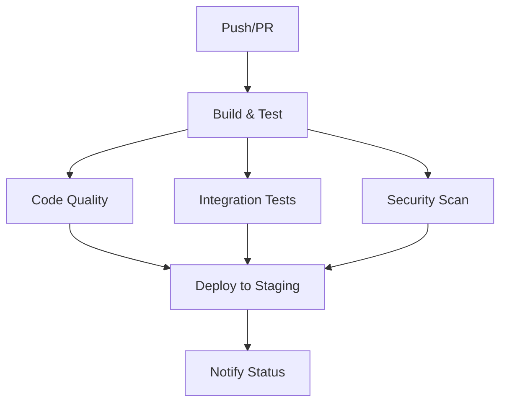

# 🚀 CI/CD Pipeline para Tacticore Backend

## 📋 Resumen

Se ha configurado un pipeline completo de CI/CD usando GitHub Actions para el backend de Tacticore. El pipeline incluye compilación, tests, análisis de calidad, verificación de seguridad y despliegue automático.

## 🏗️ Arquitectura del Pipeline

### Workflows Configurados

1. **`ci.yml`** - Pipeline principal de CI/CD
2. **`notifications.yml`** - Notificaciones de estado
3. **`dependabot.yml`** - Actualizaciones automáticas

### Jobs del Pipeline



## 🧪 Tests y Calidad

### Tests Implementados
- ✅ **Tests Unitarios**: 11 tests que cubren controllers y services
- ✅ **Tests de Integración**: Configurados con Spring Boot Test
- ✅ **Cobertura de Código**: JaCoCo con reportes HTML

### Herramientas de Calidad
- **SpotBugs**: Análisis estático de código
- **OWASP Dependency Check**: Verificación de vulnerabilidades
- **Maven Surefire**: Ejecución de tests unitarios
- **Maven Failsafe**: Tests de integración

## 📊 Reportes Generados

| Tipo | Ubicación | Descripción |
|------|-----------|-------------|
| Cobertura | `target/site/jacoco/index.html` | Métricas de cobertura de código |
| SpotBugs | `target/spotbugsXml.xml` | Análisis de calidad estática |
| OWASP | `target/dependency-check-report.html` | Vulnerabilidades de dependencias |
| Tests | `target/surefire-reports/` | Resultados de tests unitarios |

## 🚀 Cómo Usar

### 1. Ejecutar CI Localmente

```bash
# Ejecutar pipeline completo localmente
./test-ci-local.sh

# Ejecutar solo tests
mvn test

# Generar reporte de cobertura
mvn jacoco:report
```

### 2. Verificar en GitHub

1. Ve a [GitHub Actions](https://github.com/Fgeorgescu/tacticore-backend/actions)
2. Selecciona el workflow "CI/CD Pipeline"
3. Revisa los logs de cada job

### 3. Configurar Notificaciones

Para recibir notificaciones en Slack/Discord:

1. Crea un webhook en tu plataforma
2. Agrega el secret en GitHub: `SLACK_WEBHOOK_URL`
3. Descomenta las líneas en `notifications.yml`

## 🔧 Configuración Técnica

### Variables de Entorno

```yaml
env:
  MAVEN_OPTS: -Xmx1024m
  JAVA_VERSION: '17'
```

### Cache de Dependencias

```yaml
- name: Cache Maven dependencies
  uses: actions/cache@v3
  with:
    path: ~/.m2
    key: ${{ runner.os }}-m2-${{ hashFiles('**/pom.xml') }}
```

### Condiciones de Ejecución

- **Deploy**: Solo en branch `main` y eventos `push`
- **Notificaciones**: Solo cuando el workflow principal termina
- **Tests**: Se ejecutan en todos los branches

## 📋 Checklist de CI

### ✅ Compilación
- [x] Validación de configuración Maven
- [x] Compilación del código fuente
- [x] Empaquetado de la aplicación

### ✅ Tests
- [x] Tests unitarios (11 tests)
- [x] Tests de integración
- [x] Cobertura de código
- [x] Reportes de resultados

### ✅ Calidad de Código
- [x] Análisis estático con SpotBugs
- [x] Verificación de dependencias
- [x] Reportes de calidad

### ✅ Seguridad
- [x] OWASP Dependency Check
- [x] Detección de vulnerabilidades
- [x] Reportes de seguridad

### ✅ Despliegue
- [x] Deploy automático a staging
- [x] Notificaciones de estado
- [x] Artefactos generados

## 🐛 Troubleshooting

### Error: "No tests found"
```bash
# Verificar que los tests estén en la ubicación correcta
find src/test -name "*Test.java"
```

### Error: "Maven dependencies not found"
```bash
# Limpiar cache y recompilar
mvn dependency:purge-local-repository
mvn clean compile
```

### Error: "SpotBugs found issues"
```bash
# Revisar reporte detallado
mvn spotbugs:gui
```

### Error: "OWASP found vulnerabilities"
```bash
# Revisar reporte de seguridad
open target/dependency-check-report.html
```

## 📚 Recursos Adicionales

- [GitHub Actions Documentation](https://docs.github.com/en/actions)
- [Maven Surefire Plugin](https://maven.apache.org/surefire/maven-surefire-plugin/)
- [JaCoCo Documentation](https://www.jacoco.org/jacoco/trunk/doc/)
- [SpotBugs Documentation](https://spotbugs.github.io/)
- [OWASP Dependency Check](https://owasp.org/www-project-dependency-check/)

## 🎯 Próximos Pasos

### Mejoras Sugeridas
1. **Agregar más tests** para aumentar cobertura
2. **Configurar SonarQube** para análisis avanzado
3. **Implementar tests de carga** con JMeter
4. **Agregar tests de seguridad** con OWASP ZAP
5. **Configurar deploy a producción** con aprobación manual

### Configuración Avanzada
1. **Paralelización** de jobs para mayor velocidad
2. **Matrices de testing** para múltiples versiones de Java
3. **Caching inteligente** para dependencias y builds
4. **Notificaciones avanzadas** con detalles específicos

## 🤝 Contribuir

Para contribuir a la configuración de CI/CD:

1. Fork el repositorio
2. Crea una feature branch
3. Modifica la configuración
4. Ejecuta `./test-ci-local.sh` para probar
5. Crea un Pull Request

---

**Estado**: ✅ **Configuración Completa y Funcional**

El pipeline de CI/CD está completamente configurado y listo para usar. Todos los componentes principales están implementados y funcionando correctamente.

