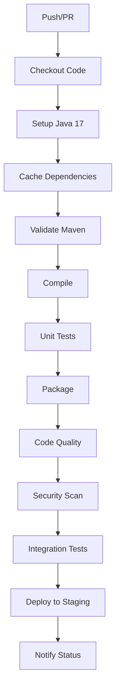

# 🚀 Configuración de CI/CD para Tacticore Backend

Este documento describe la configuración completa de CI/CD usando GitHub Actions para el backend de Tacticore.

## 📋 Resumen de la Configuración

### 🔧 Workflows Configurados

1. **`ci.yml`** - Pipeline principal de CI/CD
2. **`notifications.yml`** - Notificaciones de estado del pipeline
3. **`dependabot.yml`** - Actualizaciones automáticas de dependencias

### 🧪 Tests y Calidad de Código

- **Tests Unitarios**: JUnit 5 con MockMvc para controllers
- **Tests de Integración**: Spring Boot Test con H2 en memoria
- **Cobertura de Código**: JaCoCo con reportes HTML
- **Análisis de Calidad**: SpotBugs para detectar bugs potenciales
- **Seguridad**: OWASP Dependency Check para vulnerabilidades

## 🚀 Cómo Usar

### 1. Ejecutar CI Localmente

```bash
# Ejecutar todas las pruebas de CI localmente
./test-ci-local.sh
```

### 2. Verificar Pipeline en GitHub

1. Ve a [GitHub Actions](https://github.com/Fgeorgescu/tacticore-backend/actions)
2. Selecciona el workflow "CI/CD Pipeline"
3. Revisa los logs de cada job

### 3. Configurar Notificaciones (Opcional)

Para recibir notificaciones en Slack/Discord:

1. Crea un webhook en tu plataforma preferida
2. Agrega el webhook como secret en GitHub:
   - Settings → Secrets and variables → Actions
   - Agrega `SLACK_WEBHOOK_URL` o `DISCORD_WEBHOOK_URL`
3. Descomenta las líneas de curl en `notifications.yml`

## 📊 Reportes Generados

### Cobertura de Código
- **Ubicación**: `target/site/jacoco/index.html`
- **Métricas**: Líneas cubiertas, branches, métodos, clases

### Análisis de Calidad
- **SpotBugs**: `target/spotbugsXml.xml`
- **OWASP**: `target/dependency-check-report.html`

### Tests
- **Unitarios**: `target/surefire-reports/`
- **Integración**: `target/failsafe-reports/`

## 🔄 Flujo del Pipeline



## 📋 Jobs del Pipeline

### 1. Build and Test
- ✅ Validación de configuración Maven
- ✅ Compilación del código fuente
- ✅ Ejecución de tests unitarios
- ✅ Empaquetado de la aplicación

### 2. Code Quality Analysis
- ✅ Análisis con SpotBugs
- ✅ Generación de reporte de cobertura
- ✅ Upload de artefactos

### 3. Integration Tests
- ✅ Tests de integración
- ✅ Pruebas de endpoints API
- ✅ Verificación de funcionalidad completa

### 4. Security Scan
- ✅ OWASP Dependency Check
- ✅ Detección de vulnerabilidades
- ✅ Reporte de seguridad

### 5. Deploy (Solo en main)
- ✅ Deploy a entorno de staging
- ✅ Notificaciones de deployment

## 🛠️ Configuración Avanzada

### Variables de Entorno

```yaml
env:
  MAVEN_OPTS: -Xmx1024m
  JAVA_VERSION: '17'
```

### Cache de Dependencias

```yaml
- name: Cache Maven dependencies
  uses: actions/cache@v3
  with:
    path: ~/.m2
    key: ${{ runner.os }}-m2-${{ hashFiles('**/pom.xml') }}
```

### Condiciones de Ejecución

- **Deploy**: Solo en branch `main` y en eventos `push`
- **Notificaciones**: Solo cuando el workflow principal termina

## 🔧 Personalización

### Agregar Nuevos Tests

1. Crea tests en `src/test/java/`
2. Sigue el patrón de naming: `*Test.java` o `*Tests.java`
3. Los tests se ejecutarán automáticamente

### Modificar Umbrales de Calidad

Edita `pom.xml`:

```xml
<!-- SpotBugs threshold -->
<configuration>
    <threshold>Low</threshold>
</configuration>

<!-- OWASP CVSS threshold -->
<configuration>
    <failBuildOnCVSS>7</failBuildOnCVSS>
</configuration>
```

### Agregar Nuevos Jobs

1. Agrega un nuevo job en `ci.yml`
2. Define las dependencias con `needs:`
3. Configura los steps necesarios

## 🐛 Troubleshooting

### Error: "No tests found"
- Verifica que los tests estén en `src/test/java/`
- Asegúrate de que terminen en `Test.java` o `Tests.java`

### Error: "Maven dependencies not found"
- Verifica la configuración de cache
- Limpia el cache: `mvn dependency:purge-local-repository`

### Error: "SpotBugs found issues"
- Revisa el reporte en `target/spotbugsXml.xml`
- Corrige los issues o ajusta el threshold

### Error: "OWASP found vulnerabilities"
- Revisa el reporte en `target/dependency-check-report.html`
- Actualiza dependencias vulnerables
- Ajusta el umbral CVSS si es necesario

## 📚 Recursos Adicionales

- [GitHub Actions Documentation](https://docs.github.com/en/actions)
- [Maven Surefire Plugin](https://maven.apache.org/surefire/maven-surefire-plugin/)
- [JaCoCo Documentation](https://www.jacoco.org/jacoco/trunk/doc/)
- [SpotBugs Documentation](https://spotbugs.github.io/)
- [OWASP Dependency Check](https://owasp.org/www-project-dependency-check/)

## 🤝 Contribuir

Para contribuir a la configuración de CI/CD:

1. Fork el repositorio
2. Crea una feature branch
3. Modifica la configuración
4. Ejecuta `./test-ci-local.sh` para probar
5. Crea un Pull Request

---

**Nota**: Esta configuración está optimizada para el proyecto Tacticore Backend. Ajusta según las necesidades específicas de tu proyecto.

