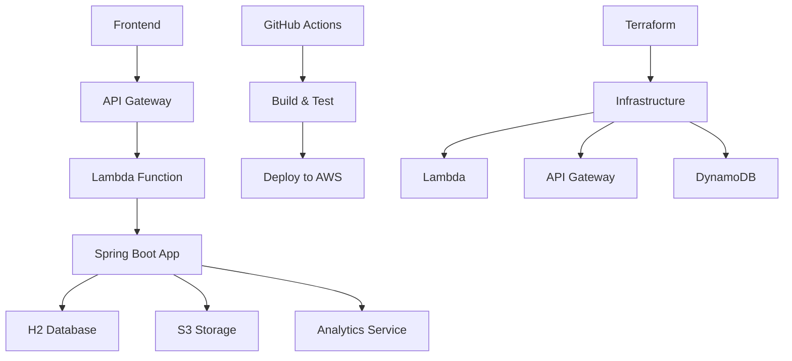

# 🎯 TactiCore Backend

> **Backend de TactiCore** - Proyecto Spring Boot con AWS Lambda para análisis de partidas de Counter-Strike

[](https://openjdk.java.net/projects/jdk/17/)
[](https://spring.io/projects/spring-boot)
[](https://maven.apache.org/)
[](https://aws.amazon.com/lambda/)
[](LICENSE)

## 🚀 Inicio Rápido

### Prerrequisitos

- **Java 17** o superior
- **Maven 3.9+**
- **AWS CLI** configurado
- **Docker** (opcional)

### Instalación

```bash
# Clonar el repositorio
git clone https://github.com/Fgeorgescu/tacticore-backend.git
cd tacticore-backend

# Compilar el proyecto
make build

# Ejecutar la aplicación
make run
```

### Verificar Instalación

```bash
# Probar el endpoint de salud
curl http://localhost:8080/ping

# Ver información del proyecto
make info
```

## 🏗️ Arquitectura

### Stack Tecnológico

- **Framework**: Spring Boot 3.2.0
- **Java**: JDK 17
- **Build Tool**: Maven
- **Base de Datos**: H2 (desarrollo) / DynamoDB (producción)
- **Cloud**: AWS Lambda + API Gateway
- **Infraestructura**: Terraform
- **CI/CD**: GitHub Actions

### Componentes Principales



## 📋 Características

### ✅ Implementado

- [x] **API REST** completa para gestión de partidas
- [x] **Base de datos H2** con datos de prueba
- [x] **Análisis de kills** con filtros por usuario
- [x] **Sistema de chat** integrado
- [x] **Analytics** y estadísticas
- [x] **CI/CD** con GitHub Actions
- [x] **Testing** automatizado
- [x] **Calidad de código** (SpotBugs, JaCoCo)
- [x] **Makefile** unificado
- [x] **Documentación** con Docsify

### 🚧 En Desarrollo

- [ ] **Autenticación** con AWS Cognito
- [ ] **Procesamiento asíncrono** de archivos DEM
- [ ] **Análisis de video** con ML
- [ ] **Dashboard** en tiempo real
- [ ] **Notificaciones** push

## 🎮 Funcionalidades

### Gestión de Partidas

- **Subir partidas** con archivos DEM y video
- **Análisis automático** de kills y estadísticas
- **Filtrado por usuario** y ronda
- **Chat integrado** para comentarios
- **Historial** de partidas

### Analytics

- **Dashboard** con métricas clave
- **Análisis histórico** de rendimiento
- **Tendencias** y comparativas
- **Reportes** detallados

### API

- **RESTful** con documentación completa
- **Filtros avanzados** por usuario, ronda, arma
- **Paginación** y ordenamiento
- **Respuestas consistentes** con códigos de estado

## 🔧 Comandos Principales

### Desarrollo

```bash
make dev          # Modo desarrollo (build + run)
make build        # Compilar proyecto
make test         # Ejecutar tests
make run          # Iniciar aplicación
make stop         # Detener aplicación
```

### Testing

```bash
make test-api     # Probar endpoints básicos
make test-all     # Todas las pruebas de API
make test-kills   # Probar endpoints de kills
make test-matches # Probar endpoints de matches
make ci           # Pipeline completo de CI
```

### Base de Datos

```bash
make db-console   # Abrir consola H2
make db-clear     # Limpiar base de datos
make db-reload    # Recargar datos dummy
```

### Despliegue

```bash
make lambda-package # Empaquetar para AWS Lambda
make docker-build   # Construir imagen Docker
make terraform-apply # Desplegar con Terraform
```

## 📊 Endpoints Principales

### Salud y Estado

- `GET /ping` - Health check
- `GET /api/health` - Estado del sistema

### Partidas

- `GET /api/matches` - Lista de partidas
- `GET /api/matches/{id}` - Detalles de partida
- `GET /api/matches/{id}/kills` - Kills de partida
- `GET /api/matches/{id}/chat` - Chat de partida

### Analytics

- `GET /api/analytics/dashboard` - Dashboard principal
- `GET /api/analytics/historical` - Datos históricos

### Configuración

- `GET /api/maps` - Mapas disponibles
- `GET /api/weapons` - Armas disponibles

## 🗄️ Base de Datos

### Entidades Principales

- **MatchEntity** - Información de partidas
- **KillEntity** - Datos de kills individuales
- **ChatMessageEntity** - Mensajes de chat
- **AnalyticsDataEntity** - Datos de analytics
- **MapEntity** - Información de mapas
- **WeaponEntity** - Información de armas

### Datos de Prueba

El sistema incluye datos de prueba que se cargan automáticamente:

- **1 partida** de ejemplo
- **Múltiples kills** con diferentes usuarios
- **Mensajes de chat** de ejemplo
- **Datos de analytics** históricos
- **Mapas y armas** predefinidos

## 🚀 Despliegue

### Desarrollo Local

```bash
# Iniciar en modo desarrollo
make dev

# La aplicación estará disponible en:
# http://localhost:8080
```

### AWS Lambda

```bash
# Empaquetar para Lambda
make lambda-package

# Desplegar con Terraform
make terraform-apply
```

### Docker

```bash
# Construir imagen
make docker-build

# Ejecutar contenedor
make docker-run
```

## 🧪 Testing

### Tests Unitarios

```bash
make test
```

### Tests de Integración

```bash
make test-integration
```

### Tests de API

```bash
make test-api
```

### Pipeline CI

```bash
make ci
```

## 📈 Monitoreo

### Logs

```bash
make logs
```

### Métricas

- **Health checks** automáticos
- **Métricas de rendimiento** en tiempo real
- **Logs estructurados** para análisis

## 🔍 Troubleshooting

### Problemas Comunes

#### Puerto en Uso

```bash
# Verificar procesos en puerto 8080
lsof -i :8080

# Detener aplicación
make stop
```

#### Error de Base de Datos

```bash
# Limpiar y recargar datos
make db-clear
make db-reload
```

#### Error de Compilación

```bash
# Limpiar y recompilar
make clean
make build
```

## 📚 Documentación

### Estructura

- **[API](api/README.md)** - Documentación completa de la API
- **[Infraestructura](infrastructure/README.md)** - Configuración de AWS y Terraform
- **[Desarrollo](development/README.md)** - Guías de desarrollo
- **[CI/CD](ci-cd/README.md)** - Pipeline de integración continua
- **[Referencias](references/README.md)** - Enlaces y recursos útiles

### Navegación

- **Sidebar** - Navegación por secciones
- **Búsqueda** - Buscar en toda la documentación
- **Paginación** - Navegar entre páginas
- **Responsive** - Optimizado para móviles

## 🤝 Contribución

### Flujo de Trabajo

1. **Fork** del repositorio
2. **Crear branch** de feature
3. **Desarrollar** y testear
4. **Crear Pull Request**
5. **Review** y merge

### Estándares

- **Código** siguiendo convenciones de Java
- **Commits** con mensajes descriptivos
- **Tests** para nueva funcionalidad
- **Documentación** actualizada

## 📄 Licencia

Este proyecto está bajo la Licencia MIT. Ver [LICENSE](LICENSE) para más detalles.

## 🔗 Enlaces

- **Repositorio**: [GitHub](https://github.com/Fgeorgescu/tacticore-backend)
- **Issues**: [GitHub Issues](https://github.com/Fgeorgescu/tacticore-backend/issues)
- **Documentación**: [Docsify](http://localhost:3000)

---

**¿Necesitas ayuda?** Consulta la [documentación completa](api/README.md) o [abre un issue](https://github.com/Fgeorgescu/tacticore-backend/issues).
