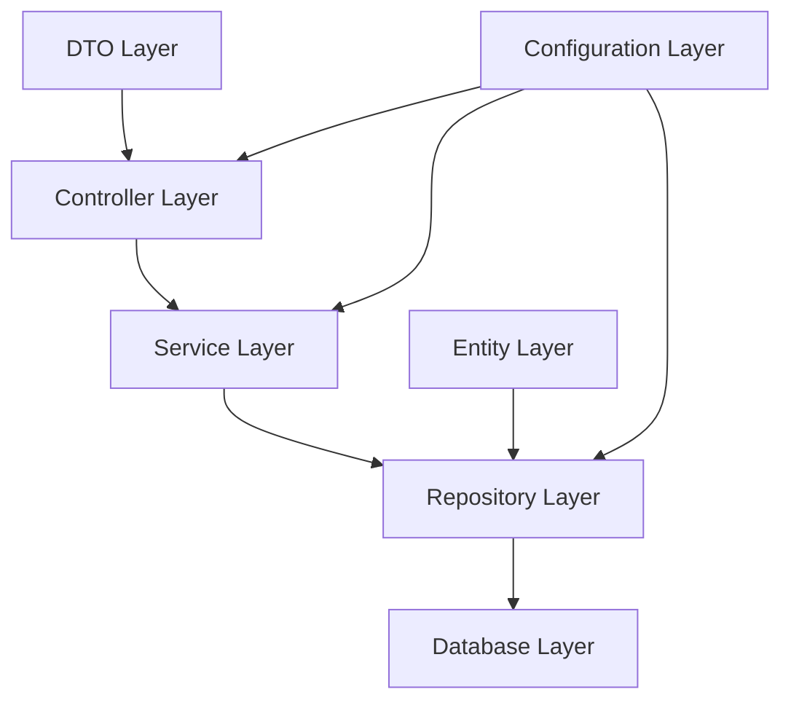

# 🏗️ Estructura del Proyecto

> Organización del código y arquitectura

## 📁 Estructura de Carpetas

```
tacticore-backend/
├── src/
│   ├── main/
│   │   ├── java/com/tacticore/lambda/
│   │   │   ├── config/          # Configuración
│   │   │   ├── controller/      # Controladores REST
│   │   │   ├── model/          # Entidades y DTOs
│   │   │   ├── repository/     # Repositorios JPA
│   │   │   ├── service/        # Lógica de negocio
│   │   │   ├── LambdaApplication.java
│   │   │   └── LambdaHandler.java
│   │   └── resources/
│   │       ├── application.yml # Configuración de Spring
│   │       └── example.json    # Datos de prueba
│   └── test/
│       └── java/com/tacticore/lambda/
│           ├── controller/     # Tests de controladores
│           └── service/        # Tests de servicios
├── docs-site/                 # Documentación con Docsify
├── terraform/                 # Infraestructura como código
├── .github/                   # Configuración de GitHub
├── Makefile                   # Comandos unificados
├── pom.xml                    # Configuración de Maven
└── README.md                  # Documentación principal
```

## 🏗️ Arquitectura

### Capas de la Aplicación



### Componentes Principales

#### 1. **Controller Layer**
- **ApiController** - Endpoints principales de la API
- **MatchController** - Gestión de partidas
- **KillAnalysisController** - Análisis de kills
- **DataController** - Gestión de datos

#### 2. **Service Layer**
- **KillAnalysisService** - Lógica de análisis de kills
- **DatabaseMatchService** - Gestión de partidas
- **ChatService** - Gestión de chat
- **AnalyticsService** - Análisis y estadísticas

#### 3. **Repository Layer**
- **KillRepository** - Acceso a datos de kills
- **MatchRepository** - Acceso a datos de partidas
- **ChatMessageRepository** - Acceso a mensajes de chat

#### 4. **Model Layer**
- **Entities** - Entidades JPA
- **DTOs** - Objetos de transferencia de datos

## 📊 Entidades

### Entidades Principales

```java
// MatchEntity - Información de partidas
@Entity
@Table(name = "matches")
public class MatchEntity {
    @Id
    private String id;
    private String fileName;
    private String mapName;
    private Integer totalKills;
    private Integer tickrate;
    private Boolean hasVideo;
    private String status;
}

// KillEntity - Datos de kills individuales
@Entity
@Table(name = "kills")
public class KillEntity {
    @Id
    private String killId;
    private String attacker;
    private String victim;
    private Integer round;
    private String weapon;
    private Boolean headshot;
    private Double distance;
    private Double timeInRound;
}

// ChatMessageEntity - Mensajes de chat
@Entity
@Table(name = "chat_messages")
public class ChatMessageEntity {
    @Id
    @GeneratedValue(strategy = GenerationType.IDENTITY)
    private Long id;
    private String matchId;
    private String userName;
    private String message;
    private LocalDateTime createdAt;
}
```

### DTOs

```java
// KillAnalysisDto - Análisis completo de kills
public class KillAnalysisDto {
    private Long totalKills;
    private Long totalHeadshots;
    private Double headshotRate;
    private Double averageDistance;
    private List<WeaponStat> weaponStats;
    private List<LocationStat> locationStats;
    private List<PlayerStat> topPlayers;
}

// PlayerStatsDto - Estadísticas de jugador
public class PlayerStatsDto {
    private String playerName;
    private Long kills;
    private Long deaths;
    private Double kdRatio;
    private Long headshots;
    private Double headshotRate;
    private Double averageDistance;
    private String favoriteWeapon;
    private Double performanceScore;
}
```

## 🔧 Configuración

### Configuración de Spring Boot

```java
// LambdaApplication.java - Clase principal
@SpringBootApplication
public class LambdaApplication {
    public static void main(String[] args) {
        SpringApplication.run(LambdaApplication.class, args);
    }
}

// WebConfig.java - Configuración web
@Configuration
public class WebConfig implements WebMvcConfigurer {
    @Override
    public void addCorsMappings(CorsRegistry registry) {
        registry.addMapping("/**")
                .allowedOrigins("*")
                .allowedMethods("GET", "POST", "PUT", "DELETE", "OPTIONS");
    }
}
```

### Configuración de Base de Datos

```yaml
# application.yml
spring:
  datasource:
    url: jdbc:h2:mem:testdb
    username: sa
    password: password
  jpa:
    hibernate:
      ddl-auto: create-drop
    show-sql: true
  h2:
    console:
      enabled: true
```

## 🧪 Testing

### Estructura de Tests

```
src/test/java/com/tacticore/lambda/
├── controller/
│   ├── ApiControllerTest.java
│   └── HelloControllerTest.java
└── service/
    └── AnalyticsServiceTest.java
```

### Ejemplo de Test

```java
@SpringBootTest
@AutoConfigureTestDatabase(replace = AutoConfigureTestDatabase.Replace.NONE)
class ApiControllerTest {
    
    @Autowired
    private TestRestTemplate restTemplate;
    
    @Test
    void testPingEndpoint() {
        ResponseEntity<String> response = restTemplate.getForEntity("/ping", String.class);
        assertEquals(HttpStatus.OK, response.getStatusCode());
        assertEquals("pong", response.getBody());
    }
}
```

## 📦 Dependencias

### Dependencias Principales

```xml
<!-- Spring Boot Starter Web -->
<dependency>
    <groupId>org.springframework.boot</groupId>
    <artifactId>spring-boot-starter-web</artifactId>
</dependency>

<!-- Spring Boot Starter Data JPA -->
<dependency>
    <groupId>org.springframework.boot</groupId>
    <artifactId>spring-boot-starter-data-jpa</artifactId>
</dependency>

<!-- H2 Database -->
<dependency>
    <groupId>com.h2database</groupId>
    <artifactId>h2</artifactId>
    <scope>runtime</scope>
</dependency>

<!-- Spring Boot Starter Test -->
<dependency>
    <groupId>org.springframework.boot</groupId>
    <artifactId>spring-boot-starter-test</artifactId>
    <scope>test</scope>
</dependency>
```

## 🔍 Patrones de Diseño

### Patrones Implementados

1. **Repository Pattern** - Acceso a datos
2. **Service Layer Pattern** - Lógica de negocio
3. **DTO Pattern** - Transferencia de datos
4. **Dependency Injection** - Inyección de dependencias
5. **Command Line Runner** - Inicialización de datos

### Ejemplo de Repository

```java
@Repository
public interface KillRepository extends JpaRepository<KillEntity, String> {
    
    @Query("SELECT k.weapon, COUNT(k) FROM KillEntity k GROUP BY k.weapon")
    List<Object[]> findWeaponUsageStats();
    
    List<KillEntity> findByAttacker(String attacker);
    List<KillEntity> findByVictim(String victim);
    Long countByAttacker(String attacker);
}
```

## 📚 Recursos Adicionales

### Documentación

- [Spring Boot Architecture](https://spring.io/projects/spring-boot)
- [JPA Best Practices](https://spring.io/guides/gs/accessing-data-jpa/)
- [Maven Project Structure](https://maven.apache.org/guides/introduction/introduction-to-the-standard-directory-layout.html)

### Herramientas

- [IntelliJ IDEA](https://www.jetbrains.com/idea/)
- [Maven](https://maven.apache.org/)
- [H2 Database](https://www.h2database.com/)

### Enlaces Útiles

- [Spring Boot Guides](https://spring.io/guides)
- [Maven Central Repository](https://search.maven.org/)
- [Java Documentation](https://docs.oracle.com/en/java/)
