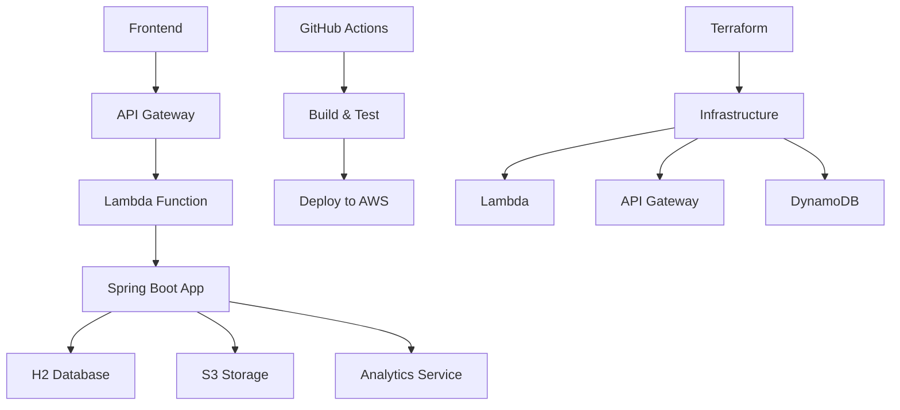

# 🏗️ Infraestructura

> Documentación de infraestructura y despliegue

## 📚 Secciones

- **[Terraform](terraform.md)** - Configuración de infraestructura como código
- **[AWS Lambda](lambda.md)** - Configuración y despliegue en Lambda
- **[Base de Datos](database.md)** - Configuración de bases de datos
- **[Docker](docker.md)** - Contenedores y orquestación

## 🚀 Arquitectura General

### Stack Tecnológico

- **Cloud Provider**: AWS
- **Compute**: AWS Lambda
- **API Gateway**: AWS API Gateway
- **Base de Datos**: H2 (desarrollo) / DynamoDB (producción)
- **Storage**: AWS S3
- **Infraestructura**: Terraform
- **Contenedores**: Docker

### Diagrama de Arquitectura



## 🔧 Configuración de Entorno

### Variables de Entorno

```bash
# AWS Configuration
AWS_REGION=us-east-1
AWS_ACCESS_KEY_ID=your_access_key
AWS_SECRET_ACCESS_KEY=your_secret_key

# Application Configuration
SPRING_PROFILES_ACTIVE=lambda
SERVER_PORT=8080

# Database Configuration
SPRING_DATASOURCE_URL=jdbc:h2:mem:testdb
SPRING_DATASOURCE_USERNAME=sa
SPRING_DATASOURCE_PASSWORD=password
```

### Perfiles de Spring

- **default** - Configuración base
- **dev** - Desarrollo local
- **lambda** - AWS Lambda
- **test** - Testing

## 🚀 Despliegue

### Desarrollo Local

```bash
# Iniciar en modo desarrollo
make dev

# La aplicación estará disponible en:
# http://localhost:8080
```

### AWS Lambda

```bash
# Empaquetar para Lambda
make lambda-package

# Desplegar con Terraform
make terraform-apply
```

### Docker

```bash
# Construir imagen
make docker-build

# Ejecutar contenedor
make docker-run
```

## 📊 Monitoreo

### Logs

```bash
# Ver logs de la aplicación
make logs

# Logs en tiempo real
tail -f app.log
```

### Métricas

- **Health checks** automáticos
- **Métricas de rendimiento** en tiempo real
- **Logs estructurados** para análisis

## 🔍 Troubleshooting

### Problemas Comunes

#### Error de Conexión a AWS

```bash
# Verificar configuración de AWS
aws configure list

# Verificar credenciales
aws sts get-caller-identity
```

#### Error de Despliegue

```bash
# Verificar estado de Terraform
cd terraform/environments/dev
terraform plan

# Aplicar cambios
terraform apply
```

#### Error de Lambda

```bash
# Verificar logs de Lambda
aws logs describe-log-groups --log-group-name-prefix /aws/lambda

# Ver logs específicos
aws logs tail /aws/lambda/tacticore-backend --follow
```

## 📚 Recursos

### Documentación

- [AWS Lambda Documentation](https://docs.aws.amazon.com/lambda/)
- [Terraform Documentation](https://www.terraform.io/docs/)
- [Docker Documentation](https://docs.docker.com/)

### Herramientas

- [AWS CLI](https://aws.amazon.com/cli/)
- [Terraform CLI](https://www.terraform.io/downloads.html)
- [Docker Desktop](https://www.docker.com/products/docker-desktop)

### Enlaces Útiles

- [AWS Console](https://console.aws.amazon.com/)
- [Terraform Registry](https://registry.terraform.io/)
- [Docker Hub](https://hub.docker.com/)
