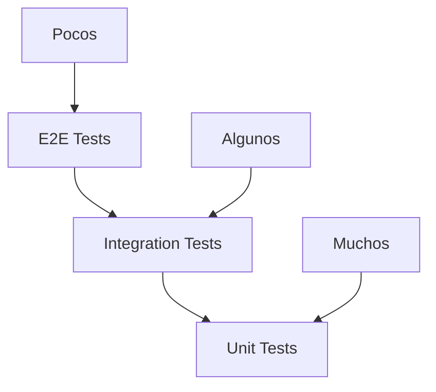

# 🧪 Testing

> Guías y estrategias de testing

## 🎯 Estrategia de Testing

### Pirámide de Testing



### Tipos de Tests

1. **Unit Tests** - Tests de unidades individuales
2. **Integration Tests** - Tests de integración entre componentes
3. **API Tests** - Tests de endpoints de la API
4. **End-to-End Tests** - Tests de flujo completo

## 🔧 Configuración

### Dependencias de Testing

```xml
<!-- pom.xml -->
<dependencies>
    <!-- Spring Boot Starter Test -->
    <dependency>
        <groupId>org.springframework.boot</groupId>
        <artifactId>spring-boot-starter-test</artifactId>
        <scope>test</scope>
    </dependency>
    
    <!-- TestContainers -->
    <dependency>
        <groupId>org.testcontainers</groupId>
        <artifactId>junit-jupiter</artifactId>
        <scope>test</scope>
    </dependency>
    
    <!-- Mockito -->
    <dependency>
        <groupId>org.mockito</groupId>
        <artifactId>mockito-core</artifactId>
        <scope>test</scope>
    </dependency>
</dependencies>
```

### Configuración de Tests

```yaml
# src/test/resources/application-test.yml
spring:
  datasource:
    url: jdbc:h2:mem:testdb
    username: sa
    password: password
  jpa:
    hibernate:
      ddl-auto: create-drop
    show-sql: false
  h2:
    console:
      enabled: false

logging:
  level:
    com.tacticore: DEBUG
    org.springframework: WARN
```

## 🧪 Tests Unitarios

### Estructura de Tests

```
src/test/java/com/tacticore/lambda/
├── controller/
│   ├── ApiControllerTest.java
│   └── HelloControllerTest.java
└── service/
    └── AnalyticsServiceTest.java
```

### Ejemplo de Test de Controller

```java
@SpringBootTest(webEnvironment = SpringBootTest.WebEnvironment.RANDOM_PORT)
@AutoConfigureTestDatabase(replace = AutoConfigureTestDatabase.Replace.NONE)
class ApiControllerTest {
    
    @Autowired
    private TestRestTemplate restTemplate;
    
    @Test
    void testPingEndpoint() {
        ResponseEntity<String> response = restTemplate.getForEntity("/ping", String.class);
        
        assertEquals(HttpStatus.OK, response.getStatusCode());
        assertEquals("pong", response.getBody());
    }
    
    @Test
    void testHealthEndpoint() {
        ResponseEntity<Map> response = restTemplate.getForEntity("/api/health", Map.class);
        
        assertEquals(HttpStatus.OK, response.getStatusCode());
        assertNotNull(response.getBody());
    }
    
    @Test
    void testMatchesEndpoint() {
        ResponseEntity<Map> response = restTemplate.getForEntity("/api/matches", Map.class);
        
        assertEquals(HttpStatus.OK, response.getStatusCode());
        assertNotNull(response.getBody());
    }
}
```

### Ejemplo de Test de Service

```java
@ExtendWith(MockitoExtension.class)
class AnalyticsServiceTest {
    
    @Mock
    private KillRepository killRepository;
    
    @Mock
    private MatchRepository matchRepository;
    
    @InjectMocks
    private AnalyticsService analyticsService;
    
    @Test
    void testGetHistoricalAnalytics() {
        // Given
        List<AnalyticsDataEntity> mockData = Arrays.asList(
            new AnalyticsDataEntity("2024-01-15", 25, 15, 1.67, 8.5, 18, 7, 1)
        );
        when(analyticsDataRepository.findAll()).thenReturn(mockData);
        
        // When
        List<AnalyticsData> result = analyticsService.getHistoricalAnalytics();
        
        // Then
        assertNotNull(result);
        assertEquals(1, result.size());
        assertEquals("2024-01-15", result.get(0).getDate());
        assertEquals(25, result.get(0).getKills());
    }
    
    @Test
    void testGetDashboardStats() {
        // Given
        when(killRepository.count()).thenReturn(143L);
        when(matchRepository.count()).thenReturn(1L);
        when(matchRepository.findAll()).thenReturn(Arrays.asList(new MatchEntity()));
        
        // When
        DashboardStats result = analyticsService.getDashboardStats();
        
        // Then
        assertNotNull(result);
        assertEquals(1, result.getTotalMatches());
        assertEquals(143, result.getTotalKills());
    }
}
```

## 🔗 Tests de Integración

### Configuración de TestContainers

```java
@SpringBootTest
@Testcontainers
class IntegrationTest {
    
    @Container
    static PostgreSQLContainer<?> postgres = new PostgreSQLContainer<>("postgres:15")
            .withDatabaseName("testdb")
            .withUsername("test")
            .withPassword("test");
    
    @DynamicPropertySource
    static void configureProperties(DynamicPropertyRegistry registry) {
        registry.add("spring.datasource.url", postgres::getJdbcUrl);
        registry.add("spring.datasource.username", postgres::getUsername);
        registry.add("spring.datasource.password", postgres::getPassword);
    }
    
    @Test
    void testDatabaseIntegration() {
        // Test de integración con base de datos real
    }
}
```

### Test de API Completa

```java
@SpringBootTest(webEnvironment = SpringBootTest.WebEnvironment.RANDOM_PORT)
class ApiIntegrationTest {
    
    @Autowired
    private TestRestTemplate restTemplate;
    
    @Test
    void testCompleteApiFlow() {
        // 1. Verificar salud de la API
        ResponseEntity<String> healthResponse = restTemplate.getForEntity("/ping", String.class);
        assertEquals(HttpStatus.OK, healthResponse.getStatusCode());
        
        // 2. Obtener partidas
        ResponseEntity<Map> matchesResponse = restTemplate.getForEntity("/api/matches", Map.class);
        assertEquals(HttpStatus.OK, matchesResponse.getStatusCode());
        
        // 3. Obtener análisis general
        ResponseEntity<Map> analysisResponse = restTemplate.getForEntity("/api/analysis/overview", Map.class);
        assertEquals(HttpStatus.OK, analysisResponse.getStatusCode());
        
        // 4. Obtener analytics
        ResponseEntity<Map> analyticsResponse = restTemplate.getForEntity("/api/analytics/dashboard", Map.class);
        assertEquals(HttpStatus.OK, analyticsResponse.getStatusCode());
    }
}
```

## 🚀 Tests de API

### Comandos de Testing

```bash
# Ejecutar todos los tests
make test

# Tests específicos
make test-api
make test-analytics
make test-matches
make test-kills

# Tests de integración
make test-integration

# Generar reporte de cobertura
make test-coverage
```

### Scripts de Testing

```bash
#!/bin/bash
# test-api.sh

echo "🧪 Testing API Endpoints"
echo "========================"

BASE_URL="http://localhost:8080"

# Test ping
echo "Testing ping endpoint..."
curl -s "$BASE_URL/ping" | grep -q "pong" && echo "✅ Ping OK" || echo "❌ Ping FAILED"

# Test health
echo "Testing health endpoint..."
curl -s "$BASE_URL/api/health" | grep -q "status" && echo "✅ Health OK" || echo "❌ Health FAILED"

# Test matches
echo "Testing matches endpoint..."
curl -s "$BASE_URL/api/matches" | grep -q "matches" && echo "✅ Matches OK" || echo "❌ Matches FAILED"

echo "Testing completed!"
```

## 📊 Cobertura de Código

### Configuración de JaCoCo

```xml
<!-- pom.xml -->
<plugin>
    <groupId>org.jacoco</groupId>
    <artifactId>jacoco-maven-plugin</artifactId>
    <version>0.8.8</version>
    <executions>
        <execution>
            <goals>
                <goal>prepare-agent</goal>
            </goals>
        </execution>
        <execution>
            <id>report</id>
            <phase>test</phase>
            <goals>
                <goal>report</goal>
            </goals>
        </execution>
    </executions>
</plugin>
```

### Generar Reporte

```bash
# Generar reporte de cobertura
make test-coverage

# Ver reporte
open target/site/jacoco/index.html
```

## 🔍 Troubleshooting

### Problemas Comunes

#### Error de Base de Datos

```bash
# Verificar configuración de H2
curl http://localhost:8080/h2-console

# Limpiar y recargar datos
make db-clear
make db-reload
```

#### Error de Tests

```bash
# Limpiar y recompilar
make clean
make build
make test
```

#### Error de Cobertura

```bash
# Verificar configuración de JaCoCo
mvn jacoco:report

# Ver reporte generado
ls -la target/site/jacoco/
```

## 📚 Recursos Adicionales

### Documentación

- [Spring Boot Testing](https://spring.io/guides/gs/testing-web/)
- [JUnit 5](https://junit.org/junit5/docs/current/user-guide/)
- [Mockito](https://javadoc.io/doc/org.mockito/mockito-core/latest/org/mockito/Mockito.html)

### Herramientas

- [JUnit 5](https://junit.org/junit5/)
- [Mockito](https://site.mockito.org/)
- [TestContainers](https://www.testcontainers.org/)

### Enlaces Útiles

- [Spring Boot Testing Guide](https://spring.io/guides/gs/testing-web/)
- [JUnit 5 Documentation](https://junit.org/junit5/docs/current/user-guide/)
- [Mockito Documentation](https://javadoc.io/doc/org.mockito/mockito-core/latest/org/mockito/Mockito.html)
